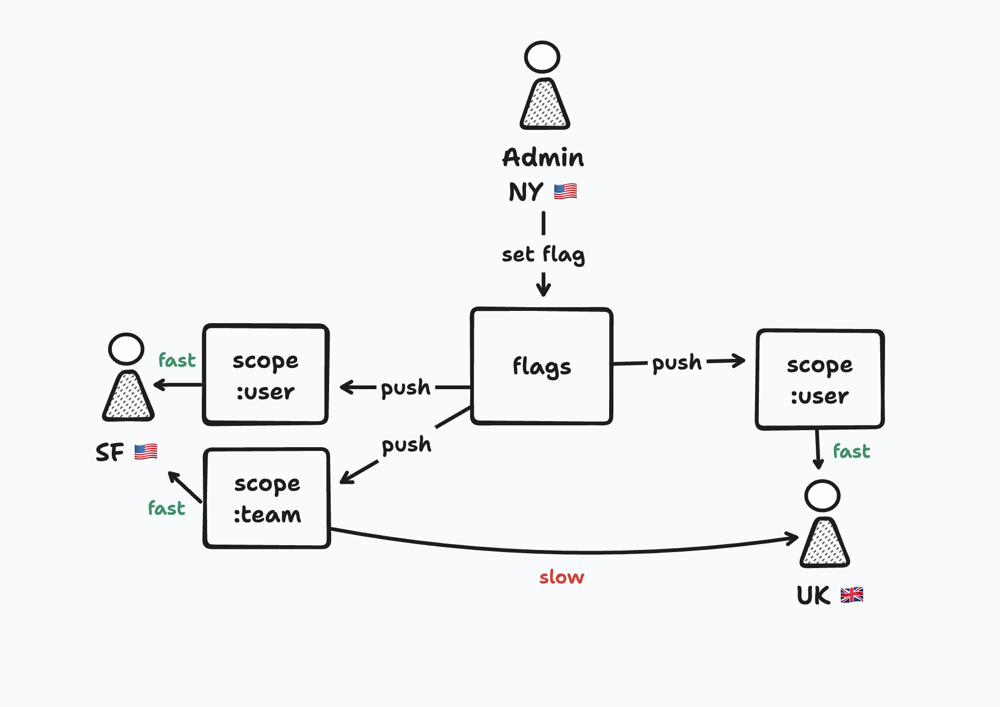

# partyflags ⛳️

`partyflags` is a minimalistic feature flagging implementation using PartyKit.

## OBS!

This repository is currently at an experimental state. Feel free to browse through the code for learning purposes, but I would not recommend trying to run it for its intended use case just yet.

## Features

- Global and scoped flags
- Real-time push of updated flags
- Distributed on edge ⚡️

### TODO

- Web UI
- JavaScript client
- React client
- Prime scope caches to make first request faster

## Architecture

`partyflags` is built entirely on PartyKit, a platform for real-time systems.

The project consists of three "parties":

### `main.ts`

Server an admin API.

### `flags.ts`

Stores the feature flags, and broadcasts changes to connected scopes.

### `scope.ts`

Allows user to connect directly from a web browser using HTTP requests or WebSockets.

In your application, you can create a scope for a team, user, group, or other use grouping by providing a unique identifier.

- A scope party us created when a first client connects to it, which should result in PartyKit creating it in the closest Cloudflare node available in the network topology.
- If you scope variables on a per-user basis, this should result in each party being created nearest to the user.

## Server API

*  `GET  /flags/:projectId`: fetch global flags for project
*  `GET  /flags/:projectId/:scopeId`: fetch scope flags for project
*  `POST /flags/:projectId`: update global flags for project
*  `POST /flags/:projectId/:scopeId`: update scope flags for project
*  `POST /scopes/:projectId`: get all scopes with flags defined in this project

